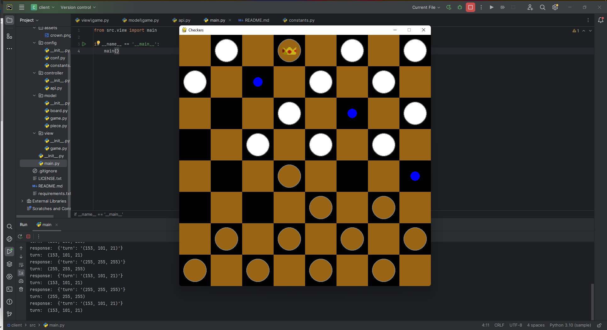

# Damion v0.1.0

The Project is Checkers game.

<br>
<a href="https://sodular.agglomy.com/lite.html#py_doc" target="_blank">Sodular</a> in Colab with Students: (Project structure, Code refactoring) <br>
<a href="https://sodular.agglomy.com/lite.html#py_doc" target="_blank"></a>

The Game folder structure:
```
|--damion
|  |-- client
|  |-- server
```

## Note: Please active your python 'venv' in each folder [client, server].

# Get Started:
- 1 Clone the repo: 
```git clone https://github.com/Lazare-Nogrette/damion.git```
- 2 Read Doc
  - 2.1 Server side:
  Documentation: https://github.com/Lazare-Nogrette/damion/tree/main/server
  - 2.2 Client side:
  Documentation: https://github.com/Lazare-Nogrette/damion/tree/main/client
### Preview


## Resources:
We got inspiration on this repository: https://github.com/techwithtim/Python-Checkers


## Contributors:
- Sobgui Ivan Joel
- Lazare
- Valentin

## Licence MIT (2024)