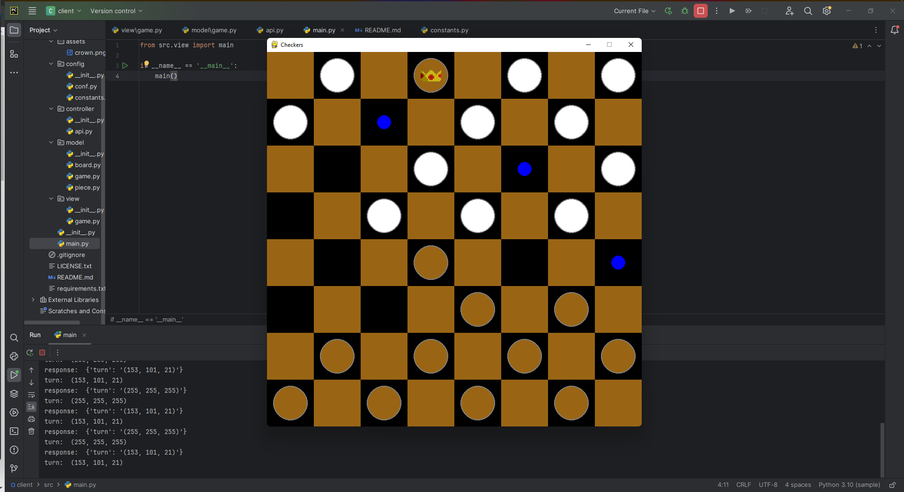

# Damion client v0.1.0
Damion is a Checker game for two players. This server project will allow you to connect with the server project <br>
<a href="https://github.com/Lazare-Nogrette/damion/tree/main/server" target="_blank">Damion server</a>.


## Get Started 
### 0. Clone the project 
If didn't clone already:
Windows : ``git clone https://github.com/Lazare-Nogrette/damion.git`` <br>
  ### 0.1 Software 
  Requirements: <a href="https://www.python.org/downloads/">Python</a> should be installed
  ### 0.2 Project structure for the client side
  ```
  client/
  |-- src/
  |   |-- assets/  #image file
  |   |-- config/
  |   |   |-- conf.py
  |   |   |-- constants.py #Colors - Image_Path - SCREEN_Size
  |   |-- model/
  |   |   |-- player.py
  |   |   |-- board.py
  |   |   |-- piece.py
  |   |-- controller/
  |   |   |-- api.py #HTTP_Request
  |   |-- view/
  |   |   |-- game.py
  |   |-- main.py #Main entry
  |-- requirements.txt # Dependencies

  ```

### 1. Setup a virtual env
```
cd damion/client
python -m venv environment_name.
```
Powsershell:`.\environment_name\Scripts\activate`
### 2. Install requirements for the project
```
pip install -r requirements.txt 
```
### 3. Launch the client
```
python src/main.py.
```
### 4. Preview


## Todo
- Removing/Reduce some unusual dependencies,functions, refactoring paths/files...
- Code Cleaning/ Making a suitable project structure with modular pattern (DRY and KISS dev).

## Join US
If you have any suggestion, contribution, feature to add ...etc
- Discord(Support Team, FAQ, Chat): 

## Contributors
- Hetic Team :
    - Ivan Joel Sobgui
    - Lazare
    - Valentin
## Licence

MIT: You can use it for educational/personal/business purpose!